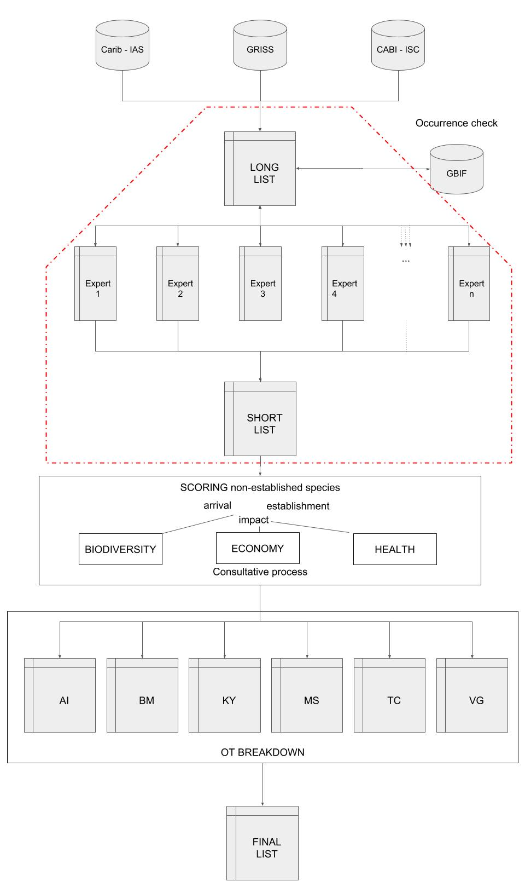

  
```{r global_options, include = FALSE}
knitr::opts_chunk$set(root.dir = "../",
                      warning=FALSE, 
                      message=FALSE)
```

# General workframe

The picture here below shows the general workflow. This pipeline will focus on the part contoured in red.



# Load libraries

```{r load_libraries}
# Work with googlesheets
library(googlesheets)

# Tidyverse packages
library(dplyr)
library(stringr)
library(readr)
library(tidyr)
library(purrr)
library(magrittr)
```

# Import expert shortlists

The experts receive a spreadsheet with a *longlist* of alien or possible future aliens. The experts are invited to review it by adding additional species on it. In the column `checklist` they should write `expert check`. They are also invited to select around 10-20 species, thus writing own shortlist of possible incoming alien species. Individual spreadsheets are made which are not globally shared with all experts community. At the moment this strategy is being tested within the vertebrates group.

The Google spreadsheets are called in the following way: `ias_UKOT_vertebrates_firstname_surname.tsv`. It contains two sheets, `LONGLIST` and `SHORLIST`. The shortlist is structured as follows:

| species   | country                 | remarks (optional)  |
|-----------|-------------------------|---------------------|
| example1  | KY, AI, BM              |     remark1         |
| example2  | AI, BM, MS, TC, VG, KY  |     remark2         |
| example3  | KY, AI, BM              |     ...             |

The columns `species` and  `country` are mandatory while `remarks` is optional.
Countries should be comma separated values as shown in the table above and should contain one or more of the 6 Caribbean UKOTs.

We select the spreadsheets to import:

```{r select_spreadsheets}
experts <- c("Elena_Tricarico",
             "Fred_Burton",
             "Ian_Winfield",
             "Jane_Haakonsson_Sophie_O’Hehir",
             "Latisha_Martin",
             "Mark_Outerbridge",
             "Nancy_Pascoe",
             "Rose-Smyth_Christine",
             "Jason_Berry",
             "Bryan_Manco",
             "Tim_Adriaens")
gss_experts <- str_c("ias_UKOT_vertebrates_", experts, ".tsv")
my_sheets <- gs_ls()
experts_ss <- my_sheets %>% 
  filter(sheet_title %in% gss_experts)
experts_ss <- map_dfr(unique(experts_ss$sheet_title), 
                      function(x) experts_ss %>% 
                        filter(sheet_title == x) %>%
                        filter(updated == max(updated)))
# vector experts present in Google Drive and ordered as such
experts_from_gssheets <- unlist(
  map(
    experts_ss$sheet_title, ~ str_split(
      ., pattern = "ias_UKOT_vertebrates_")[[1]][2]
))
experts_from_gssheets <- str_sub(experts_from_gssheets, 
                                 end = -(str_length(".tsv")+1))
experts_ss$sheet_title
```

We import the experts' shortlists by these spreadsheets:

```{r import_spreadsheets, results= "hide"}
title_ssheets <- map(experts_ss$sheet_title, ~ gs_title(.))
dfs_experts <- map(
  title_ssheets, ~ gs_read(ss = ., ws = "SHORTLIST")
)
```

We provide names to this list of dataframes. We name them by expert name:

```{r name_by_expert}
names(dfs_experts) <- experts_from_gssheets
```


We save a copy of the shortlists locally as`.tsv` files in the directory `./data/raw/`:

```{r save_raw_shortlists, results = "hide"}
map(names(dfs_experts), ~ write_tsv(dfs_experts[[.]], 
                                    path = paste0("../data/raw/ias_UKOT_vertebrates_", ., ".tsv")))
```

An example from the shortlist of one expert:

```{r explore}
dfs_experts$Tim_Adriaens
```


Tidy the dataframes (one row per species per country):

```{r tidy_dfs}
# remove any whitespace experts could ever have introduced
dfs_experts <- map(dfs_experts, function(x) x %>%
                     mutate(UKOTs = str_replace_all(UKOTs, 
                                                pattern = " ",
                                                replace = "")))
dfs_experts <- map(dfs_experts, 
                   function(x) x %<>% 
                     separate_rows(UKOTs, sep = ","))
# add name experts
dfs_experts <- map(names(dfs_experts),
                   function(x) dfs_experts[[x]] %<>%
                     mutate(expert = x))
```


# From shortlists to a combined list of species

We can now combine the information provided by all experts:

```{r combine_dfs_experts}
combined_dfs <- bind_rows(dfs_experts)
combined_counts_species <- combined_dfs %>% group_by(species, 
                                                     UKOTs) %>%
  summarize(n = n(), 
            experts = toString(na.omit(expert)),
            remarks = toString(na.omit(`remarks (optional)`))) %>%
  ungroup() %>%
  filter(!species == "Dummy Dummy") %>%
  distinct() %>%
  mutate(experts = str_replace_all(experts, 
                                   pattern = " ",
                                   replace = ""))
```

Notice that we *summarized* preserving the names of the experts. It will be a very useful information in order to discuss scoring among experts. 

# Manage inconsistencies between merged list and longlist

We have to check the consistency between the merged shorlist and longlist. It can be just a typo or it can be that an expert adds a species in his/her shortlist without first adding it in the longlist, everything is possible with humans!

```{r check_consistency_merged_shortlist_longlist}
source('./check_completeness_longlist.R')
unconsistencies <- check_completeness_longlist(
  longlist_filename = "ias_UKOT_vertebrates_invertebrates.tsv", 
  merged_species_df = combined_counts_species, 
  ws_longlist = "longlist", 
  row_number_longlist = 1,
  col_name_species_longlist = "species")
```

We save this list:

```{r check_unconsistencies}
write_tsv(unconsistencies,
          path = "../data/interim/unconsistencies_shortlists_vs_longlist.tsv")
```

Again, the column `experts` can help in case some doubts arise. In case of typos or synonyms, these species should be removed or modified in order to maintain consistency between longlist and (merged) shortlist, otherwise they should be added to the longlist.

# The combined shorlist: an overview

Based on this combined shortlist, the experts could start scoring process. However, it could be helpful to provide an exploratory overview to the team leader. 

Which (unique) species are present in the combined shorlist?

```{r general_species_list}
species_list <- combined_counts_species %>%
  arrange(desc(n)) %>%
  distinct(species)
species_list
```

To a better overview, let's spread such list by UKOTs:

```{r spread_table}
merged_species_list_spread <- spread(combined_counts_species, 
                                     key = UKOTs,
                                     value = n)
merged_species_list_spread
```

And save it:

```{r save_spread_table}
write_tsv(merged_species_list_spread, path = "../data/output/merged_species_list_spread.tsv")
```

It could be also important to have an overview of species combined with the number of experts who judge them present in the horizon. In case the same species has different number of assessors for different UKOTs, take the maximum.

```{r species_number_experts}
overview_species <- combined_counts_species %>% 
  group_by(species) %>% 
  summarize(n_experts = max(n)) %>%
  arrange(desc(n_experts))
overview_species
```

Let's save it in `../data/output/first_round_as_UKOTs.tsv`:

```{r write_general_species_list}
write_tsv(overview_species,
          path = "../data/output/overview_species_number_experts.tsv")
```
